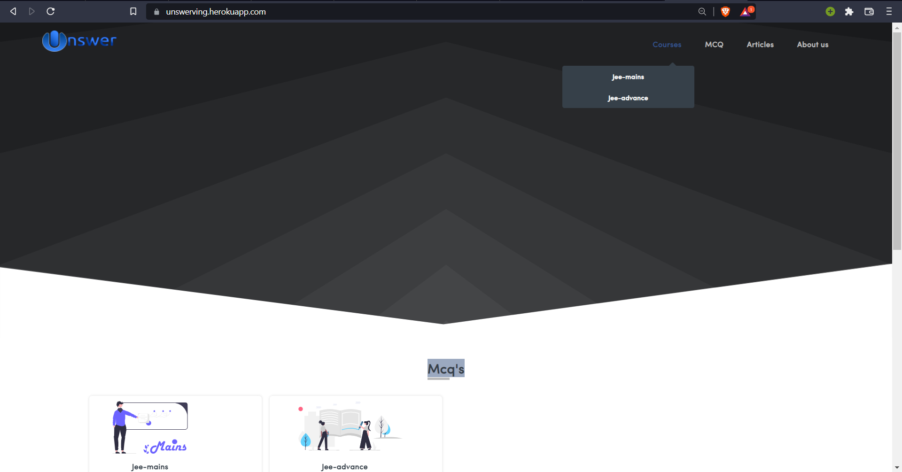

<h2><a href="https://unswerving.herokuapp.com/">Unswerving</a> (A Django Project)</h2>

Project is all about to provide free content to students with :

- Article's
- Mcq's

It has it own dhasboard (other than django provide) with all the functionaltiy for a content creator

- (CRUD)-by member who add and superuser(owner):

  - article's
  - mcq's
  - add pics for arcticles (ckeditor used to use upload pic link to article)
